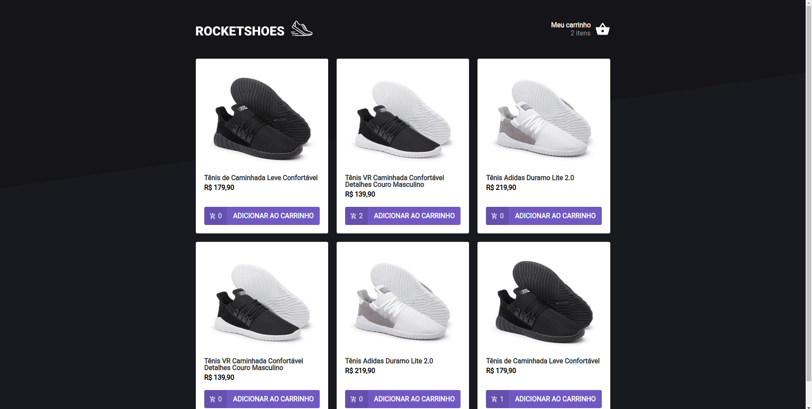
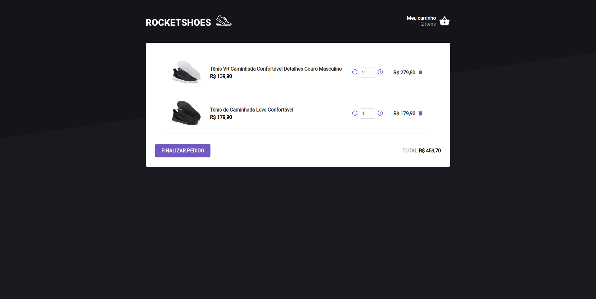
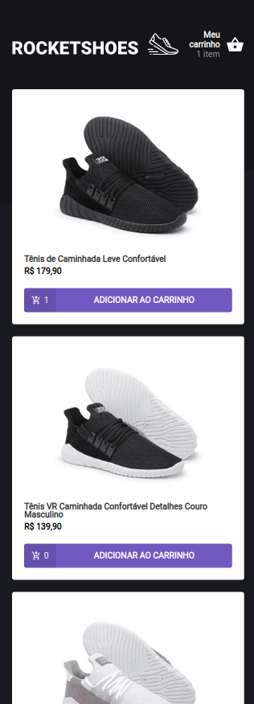

<h1 align="center">
   RocketShoes
</h1>

 

## :camera: Demonstração

## :rocket: Tecnologias

Esse projeto foi desenvolvido com as seguintes tecnologias:

✔️Typescript

✔️React

✔️Context API

✔️Web Storage API

✔️React-Toastify

✔️React-Icons

✔️React-Router-Dom

✔️React Hooks

✔️Styled-components

✔️Polished

✔️json-server

✔️Axios

## 💻 Projeto

RocketShoes trata-se de uma página web que simula um simples E-commerce de vendas de sapatos, onde armazena-se os items adicionados pelo usuário ao carrinho salvando-os no Local Storage, permanencendo os dados selecionados, caso o usuário recarregue a página.

## ⚙ Configuração

1- Para instalar as dependências:

> yarn

2- Para iniciar a aplicação digite cada comando em 2 terminais paralelos diferentes:

> yarn server

> yarn dev
